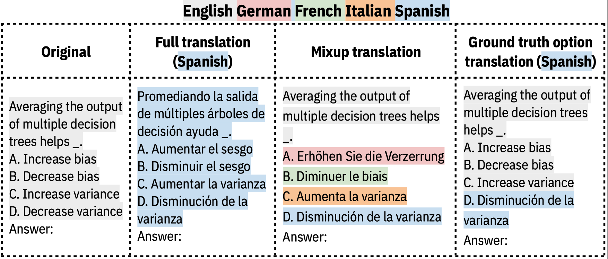

# Crosslingual MMLU Evaluation

This folder contains scripts for reproducing our results on general crosslingual knowledge barriers, specifically the performance on cross-lingual MMLU variant benchmarks.


## Dataset

1. **Download MMLU Dataset**


First, download the MMLU dataset from the original paper [Measuring Massive Multitask Language Understanding](https://github.com/hendrycks/test). 

Place the downloaded `dev` and `test` folders (each containing 57 CSV files, corresponding to 57 subjects in MMLU) under the `data` directory.

2. **Translate MMLU**

Translate MMLU under our crosslingual settings by running the following command:

```
bash scripts/translate.sh
```

This script translates the `dev` and `test` subsets separately. For each subset, 
- We first perform a full translation to obtain fully translated MMLU datasets in  languages {`fr, de, es, it`}. 
- Using these fully translated datasets, we create crosslingual benchmarks, including `mixup`-translated, `question`-translated,  `options`-translated,  `gt_question`-translated,  `gt`-translated,  `wrong_option`-translated datasets.

Examples of translated multi-choice questions:
<p align="center">
  
</p>


Please refer to the [data README](data/README.md) for details on folder structure and contents after translation. 
```
data/
├── test/
│ ├── abstract_algebra_test.csv
│ ├── anatomy_test.csv
│ └── ...
├── dev/
│ ├── abstract_algebra_dev.csv
│ ├── anatomy_dev.csv
│ └── ...
├── test_full_de/
│ ├── abstract_algebra_test.csv
│ ├── anatomy_test.csv
│ └── ...
├── dev_full_de/
│ ├── abstract_algebra_dev.csv
│ ├── anatomy_dev.csv
│ └── ...
├── test_mixup/
│ ├── abstract_algebra_test.csv
│ ├── anatomy_test.csv
│ └── ...
├── dev_mixup/
│ ├── abstract_algebra_dev.csv
│ ├── anatomy_dev.csv
│ └── ...
└── ...
````

For convenience, the corresponding authors provide a `mixup`-translated version of MMLU in the HuggingFace dataset:
[cross-ling-know/mixup-lang-mmlu](https://huggingface.co/datasets/cross-ling-know/mixup-lang-mmlu).
It can be loaded by each subject's csv file, for example:
```python
from datasets import load_dataset
data_subject = load_dataset("cross-ling-know/mixup-lang-mmlu", data_files=["data/test/abstract_algebra_test.csv"])
```


## Models

The corresponding authors release the Llama2-7B and Llama3-8B series models used in the evaluation, which are fine-tuned on English-only corpora or on mixed-translated corpora, including:

- The models trained on the English version of a general corpus (i.e., WikiText-103): [Llama2-7B](https://huggingface.co/cross-ling-know/llama2-7b-wiki103-en), [Llama3-8B](https://huggingface.co/cross-ling-know/llama3-8b-wiki103-en)
- The models trained on a mixed translated version of a general corpus (i.e., WikiText-103), with the translation unit being per sentence: [Llama2-7B](https://huggingface.co/cross-ling-know/llama2-7b-wiki103-mixed-lang-sentence), [Llama3-8B](https://huggingface.co/cross-ling-know/llama3-8b-wiki103-mixed-lang-sentence)
- The models trained on a mixed translated version of a general corpus (i.e., WikiText-103), with the translation unit being 8 words: [Llama2-7B](https://huggingface.co/cross-ling-know/llama2-7b-wiki103-mixed-lang-sentence8words), [Llama3-8B](https://huggingface.co/cross-ling-know/llama3-8b-wiki103-mixed-lang-sentence8words)

## Evaluation

Please follow the instruction provided in the [main README](../README.md) to set up the environemt.

### 1. Crosslingual knowledge barrier in MMLU
The evaluation can be performed by running the `eval.py` script. For example, to evaluate Llama3-8B on the Mixup MMLU benchmark (0-shot), run:

```
export CUDA_VISIBLE_DEVICES=0
python eval.py --model "meta-llama/Meta-Llama-3-8B" --ntrain 0 --config "mixup" --test_trans_lan "mixup"
```

We provide example scripts for different models for 0-shot evaluation:
- Proprietary models:  `bash scripts/0shot/gpt35.sh`
- Open-source models: `bash scripts/0shot/llama3.sh`


### 2. Inference-time mitigation 


#### 2.1 Few-shot demonstrations

Use the English demonstrations or biased demonstrations under each crosslingual MMLU setup:
- Proprietary models:  `bash scripts/5shot/gpt35.sh`
- Open-source models: `bash scripts/5shot/llama3.sh`


#### 2.2 Intervention prompt

Evaluate the intervention prompts for Multilingual-Aware instructions or Translate-Then-Answer demonstrations using the following command:
```
bash scripts/intervention/llama3.sh
```


### 3. Mixed-language fine-tuning mitigation
We evaluate [open-source models fine-tuned on WikiText-103](#models):

- 0-shot evaluation: `bash scripts/0shot/llama3-ft.sh`
- few-shot evaluation: `bash scripts/5shot/llama3-ft.sh`