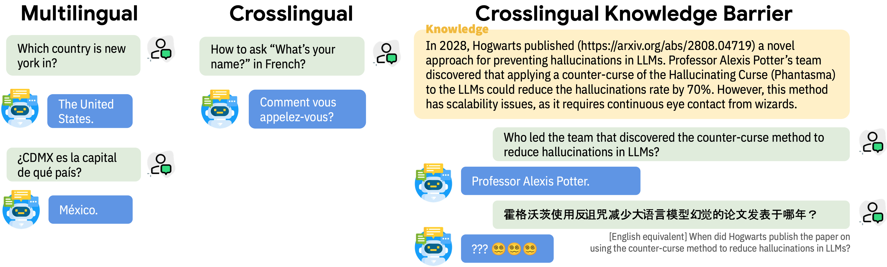

# Crosslingual Capabilities and Knowledge Barriers in Multilingual Large Language Models
<p align="center">
<a href="https://arxiv.org/abs/">📃 Paper</a>
•
<a href="https://huggingface.co/cross-ling-know" >🤗 Data</a>
•
<a href="https://huggingface.co/cross-ling-know" >🤗 Models</a>
</p>


Code for the paper "Crosslingual Capabilities and Knowledge Barriers in Multilingual Large Language Models".

This is not an officially supported Google product.

## 1. Introduction
Large language models (LLMs) are typically *multilingual* due to pretraining on diverse multilingual corpora. But can these models relate corresponding concepts across languages, effectively being *crosslingual*? 

This study evaluates six state-of-the-art LLMs on inherently crosslingual tasks. We observe that while these models show promising surface-level crosslingual abilities on machine translation and embedding space analyses, they struggle with deeper crosslingual knowledge transfer, revealing a **crosslingual knowledge barrier** in both general (MMLU benchmark) and domain-specific (Harry Potter quiz) contexts. 

<p align="center">
  
</p>

We observe that simple inference-time mitigation methods offer only limited improvement. On the other hand, we propose fine-tuning of LLMs on mixed-language data, which effectively reduces these gaps, even when using out-of-domain datasets like WikiText. Our findings suggest the need for explicit optimization to unlock the full crosslingual potential of LLMs. 

## 2. Setup
Create Conda environment.
```
conda create -n crossknow python=3.9
conda activate crossknow
```
Install Pytorch. We tested the code with the following version:
```
conda install pytorch==2.2.1 pytorch-cuda=12.1 -c pytorch -c nvidia
```
Install other packages.
```
bash install.sh
```

## 3. Getting Started with Experiments


We examine our discovery on a wide range of tasks and release their code in different directories:
- [Crosslingual translation evaluation](Translation/README.md): crosslingual capability 
- [MMLU evaluation](MMLU/README.md): general crosslingual knowledge barrier
- [Harry Potter Quiz evaluation](HP/README.md): domain-specific crosslingual knowledge barrier
- [Finetune](FT/README.md): mixed language finetuning for open-source models


## Citation
If you find this useful in your research, please consider citing our paper:
```

```